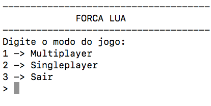
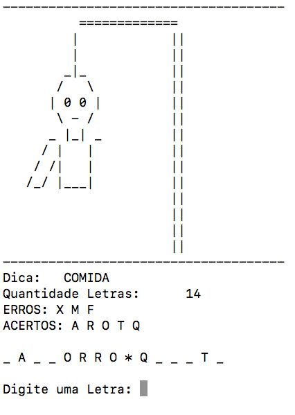
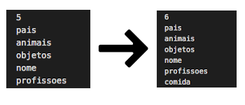

# ForcaLua
Jogo da Forca desenvolvido em Lua.

## Objetivos
Mostrar uma das inúmeras utilidades que a programação nesta linguagem, pode proporcionar, como neste trabalho, utiliza-se o exemplo de um jogo.

## Tecnologia Usada
A linguagem utilizada, neste jogo da forca, foi a linguagem Lua (versão 5.3.5) frequentemente utilizada com um propósito geral, por ser extensível para a criação de softwares complexos, como por exemplo jogos. Esta está possuindo grande evidência mundial, devido ser capaz de atribuir recursos  de configuração a aplicações já desenvolvidas com um mínimo de integração.


## Funcionalidades e Modo de Usar
Com este jogo, pode-se verificar alguns itens que através do seu algoritmo, podem ser considerados essenciais nas linguagens de programação, como a crição de funções, desvios condicionais, dentre outros.

O ForcaLua possui dois modos de jogo, o singleplayer e multiplayer. 



No modo singueplayer (1 jogador) o jogo sorteará dicas e palavras cadastradas nos arquivos de dados, atualmente estão cadastradas 679 palavras para as dicas: animais, nomes, objetos, paises e profissões, todas sem acentuação e incluídas palavras compostas.

No modo multiplayer (mais de 1 jogador), o jogo solicita ao jogador um uma dica e uma palavra, e que após iniciado o jogo cumbirá o jogador 2 adivinha-lá.

Este é o visual do jogo e as informações que ele fornece, sendo a dica a quantidade de letras sem a contagem dos espaços que são representados por um * (asterisco), além de uma lista das letras acertadas e erradas. O também é desconsiderado o caso de digitada letra repetida ou espaço.



## Instalação
Para intalar e executar, é necessária a instalação do Lua. Segue os comandos para instalação:
    
* Windows: 
        [Download LuaForWindows](https://code.google.com/archive/p/luaforwindows/downloads)
* Ubuntu ou Derivados: 

    ```
    sudo apt install lua
    ```

* MacOS: 
    ```
    brew install lua 
    ```


Após finalizar a instalação, baixe ou clone esse projeto em seu computador. Utilizando o terminal navegue até o diretório onde o jogo está localizado e execute o seguinte comando para executar:

```
lua forca.lua
```

## Material de Consulta
Para desenvolvimento desse jogo foi utilizada somente a documentação oficial da linguagem em português: Disponível em: <https://www.lua.org/manual/5.2/pt/manual.html>

## Adicionar ou Alterar palavras
O jogo possui a seguinte estrutura de arquivos:


  - /screen 
  - dicas.words
  - nome.words
  - animais.words
  - objetos.words
  - pais.words
  - profissoes.words
  - README.md         
  - LICENCE               
  - game.lua
  - forca.lua

Os arquivos que possuem extenção .words fazem parte do banco de palavras em que cada arquivo possui na primeira linha a quantidade de palavras digitadas por linha no arquivo (lembrando que as palavras não podem possuir acentuação).

Para adicionar palavras em algum dos arquivos, asta adicioná-las no fim do arquivo com a dica desejada e acrecentar a quantidade adicionada ao numero de palavras do arquivo na primeira linha.

Já para adicionar uma nova dica ou categoria de palavras, deve-se ciar um arquivo com a extenção .words como por exemplo: [ comida.words ] cujo nome do arquivo não poderá ser uma palavra composta.

Após isso basta ir ao arquivo dicas.words e adicionar uma linha com o nome do arquivo e acrescentar na primeira linha a quantidade de linhas acrescentadas, assim o jogo passará a mapear o seu arquivo adicionado. Veja no exemplo a adição da dica comida, cujo arquico comida.words já foi criado.



## Sobre o Projeto

#### Desenvolvido por:
* Reinaldo Junio Dias de Abreu
* Talita Rodrigues
#### Instituição
* Instituto Federal do Norte de Minas Gerais
#### Disciplina
* Paradigmas de Programação
* Professora: Luciana Balieiro Cosme
#### Data
* 02 de Julho de 2019 